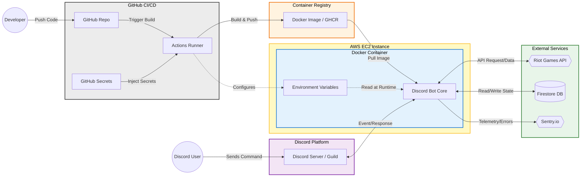
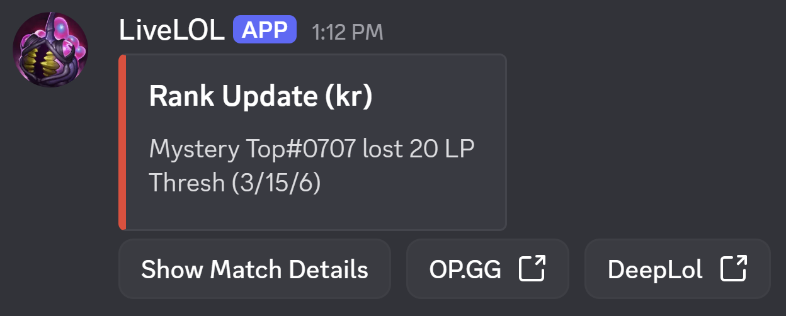
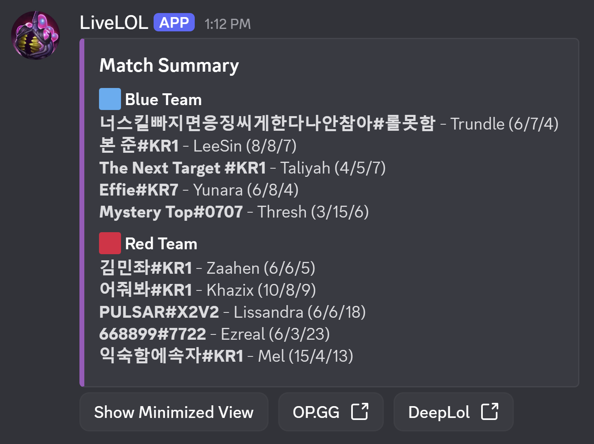

# LiveLOL
A Discord bot that tracks League of Legends players in real-time.

## Installation
1. Click this link and select which server you want to add the bot to.
    * https://discord.com/oauth2/authorize?client_id=1441206408577290400
2. Type !help and read disclaimers and important information.
3. Use !track to begin tracking users in your server, making sure to use !updateshere in the channel you want live updates posted in.

## System Architecture

## Preview
The bot provides toggleable match summaries. Users can view a high-level rank update or expand the view to see the full role-sorted team breakdown.
<table border="0">
  <tr>
    <td valign="top" width="45%">
      
<b>Minimized View</b>

      
    </td>
    <td valign="top" width="45%">
      
<b>Maximized View</b>

      
    </td>
  </tr>
</table>

Track the progress of everyone in your guild with a formatted, real-time leaderboard.

## Core Features
1. Observability
    * Sentry Integration
    * Structured Logging
2. Asychronous API Management
    * Custom handling for Riot API 429 errors to ensure combatability with API rate limits
    * Persistent Sessions that reduce latency and resource consumption
3. Scalable Data Architecture
    * NoSQL Storage using Google Firestore
    * Hosted on AWS EC2
4. DevOps Pipeline
    * Containerization for consistent deployment
    * Github Actions workflow for CI/CD
    * Unit Tests
    * Linting via Ruff enforced before every push

## Tech Stack & Design Decisions
| Category | Tool | Why this choice? |
| :--- | :--- | :--- |
| **Language** | Python 3.12 | Stable Python version with solid performance. |
| **Environment** | UV & Ruff | Chosen for dependency resolution and flexible linting. |
| **Infrastructure** | AWS EC2 & Docker | Ensures 24/7 uptime and environment parity between local dev and production. |
| **Database** | Firebase Firestore | NoSQL structure allows for flexible "tracked user" schema and real-time updates. |
| **Observability**| Sentry.io | Provides proactive error tracking and performance monitoring in the cloud. |

## Getting Started
1. Prerequisites
    * Python 3.12+
    * Docker & Docker Compose
    * Riot Games API Key - Via Riot Developer Portal
    * Firebase Credentials (Base 64 Encoded) - Via Google Firestore
    * Discord Credentials - Via Discord Developer Portal
    * Sentry Credentials - Via Sentry.io
2. Clone the repository
    * git clone [https://github.com/IanStacked/livelol.git](https://github.com/IanStacked/livelol.git)
    * cd LiveLOL
3. Install Dependencies
    * uv sync
4. Configure Environment
    * Create a .env file with your credentials
5. Run the Bot
    * docker-compose up --build

