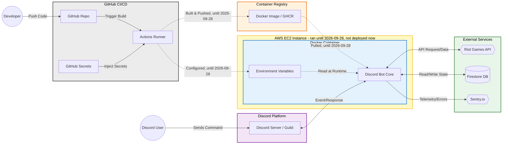
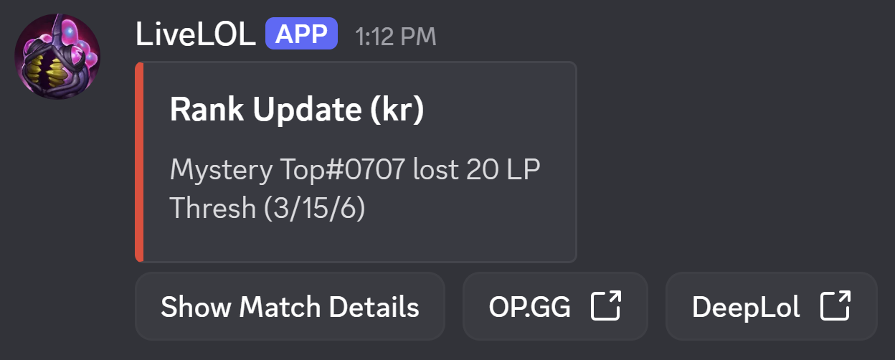
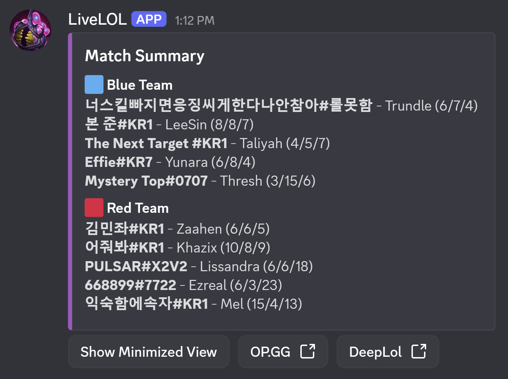

# LiveLOL
A Discord bot that tracks League of Legends players in real-time.

## Installation
1. Click this link and select which server you want to add the bot to.
    * https://discord.com/oauth2/authorize?client_id=1441206408577290400
2. Type !help and read disclaimers and important information.
3. Use !track to begin tracking users in your server, making sure to use !updateshere in the channel you want live updates posted in.

## System Architecture

```mermaid
graph LR
    %% Actors
    Dev((Developer))
    User((Discord User))

    subgraph GH [GitHub CI/CD]
        Repo[GitHub Repo]
        Secrets[GitHub Secrets]
        Actions[Actions Runner]
    end

    subgraph Registry [Container Registry]
        Image[Docker Image / GHCR]
    end

    subgraph AWS [AWS EC2 Instance - ran until 2026-09-28, not deployed now]
        subgraph Docker [Docker Container]
            Bot[Discord Bot Core]
            Env[Environment Variables]
        end
    end

    subgraph Discord [Discord Platform]
        Server[Discord Server / Guild]
    end

    subgraph External [External Services]
        Riot{{Riot Games API}}
        Firebase[(Firestore DB)]
        Sentry{{Sentry.io}}
    end

    %% Deployment Path (historical - ended 2026-09-28, no longer runs)
    Dev -->|Push Code| Repo
    Repo -->|Trigger Build| Actions
    Secrets -->|Inject Secrets| Actions
    Actions -.->|Built & Pushed, until 2026-09-28| Image
    Image -.->|Pulled, until 2026-09-28| Bot
    Actions -.->|Configured, until 2026-09-28| Env

    %% User Interaction Path
    User -->|Sends Command| Server
    Server <-->|Event/Response| Bot

    %% Application Logic
    Bot <-->|API Request/Data| Riot
    Bot <-->|Read/Write State| Firebase
    Bot -- Telemetry/Errors --> Sentry
    Env -.->|Read at Runtime| Bot

    %% Styling
    style GH fill:#ececec,stroke:#333,stroke-width:2px,color:#000000
    style Registry fill:#fff3e0,stroke:#ef6c00,stroke-width:2px,color:#000000
    style AWS fill:#fff9c4,stroke:#fbc02d,stroke-width:2px,color:#000000
    style Docker fill:#e3f2fd,stroke:#1976d2,stroke-width:2px,color:#000000
    style Discord fill:#f3e5f5,stroke:#7b1fa2,stroke-width:2px,color:#000000
    style External fill:#e8f5e9,stroke:#2e7d32,stroke-width:2px,color:#000000
```

## Hosting (history)
The bot ran on an AWS EC2 instance, deployed by GitHub Actions on every merge to
`main`, until the operator tore the host down on 2026-09-28. The bot is not
deployed anywhere now, and `main` no longer builds or pushes a deploy image.
The last deployed image tags remain on Docker Hub under `league-bot`.

## Preview
The bot provides toggleable match summaries. Users can view a high-level rank update or expand the view to see the full role-sorted team breakdown. Includes region information.
<table border="0">
  <tr>
    <td valign="top" width="45%">
      
<b>Minimized View</b>

      
    </td>
    <td valign="top" width="45%">
      
<b>Maximized View</b>

      
    </td>
  </tr>
</table>

Track the progress of everyone in your guild with a formatted, real-time leaderboard.

## Core Features
1. Observability
    * Sentry Integration
    * Structured Logging
2. Asychronous API Management
    * Custom handling for Riot API 429 errors to ensure combatability with API rate limits
    * Persistent Sessions that reduce latency and resource consumption
3. Scalable Data Architecture
    * NoSQL Storage using Google Firestore
    * Ran on AWS EC2 until 2026-09-28; not deployed now
4. DevOps Pipeline
    * Containerization, used while deployed
    * Github Actions workflow for CI (the CD half retired with the host on 2026-09-28)
    * Unit Tests
    * Linting via Ruff enforced before every push
5. Region Handling
    * Global shard support for all Riot regional platforms
    * Fail-Fast architecture for regional shard outages
    * Infrastructure aware rate limiting that reduces unnecessary API calls

## Tech Stack & Design Decisions
| Category | Tool | Why this choice? |
| :--- | :--- | :--- |
| **Language** | Python 3.12 | Stable Python version with solid performance. |
| **Environment** | UV & Ruff | Chosen for dependency resolution and flexible linting. |
| **Infrastructure** | AWS EC2 & Docker | Ran on EC2 until 2026-09-28 for 24/7 uptime and dev/prod parity; not deployed now. |
| **Database** | Firebase Firestore | NoSQL structure allows for flexible "tracked user" schema and real-time updates. |
| **Observability**| Sentry.io | Provides proactive error tracking and performance monitoring in the cloud. |

### Software Licensing
**Copyright (c) 2025-2026 IanStacked. All Rights Reserved.**

This project is not open-source. See LICENSE.md for more details.

### Riot Games Disclaimer
LiveLOL isn't endorsed by Riot Games and doesn't reflect the views or opinions of Riot Games or anyone officially involved in producing or managing Riot Games properties. Riot Games, and all associated properties are trademarks or registered trademarks of Riot Games, Inc.