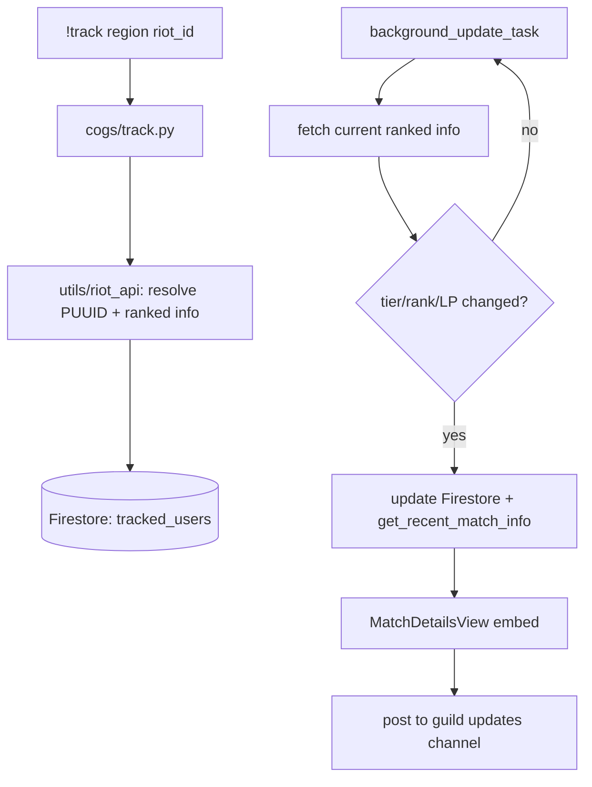
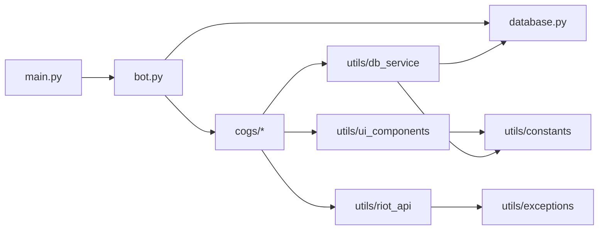

# Project Overview (Mermaid)

> **Paste-ready sources:** keep fence-free copies of each diagram in `agent/diagrams/` so
> they load directly into https://mermaid.live without trimming the ```` ```mermaid ````
> fence. Keep the two copies in sync when editing.

## 1. Live update loop (end-to-end)



## 2. Module dependencies


